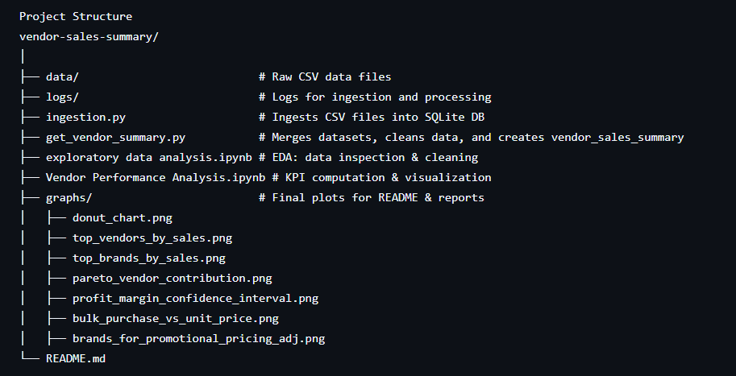
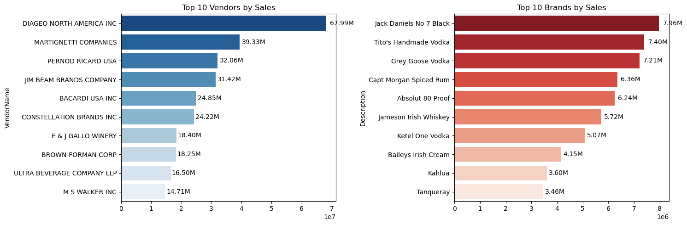
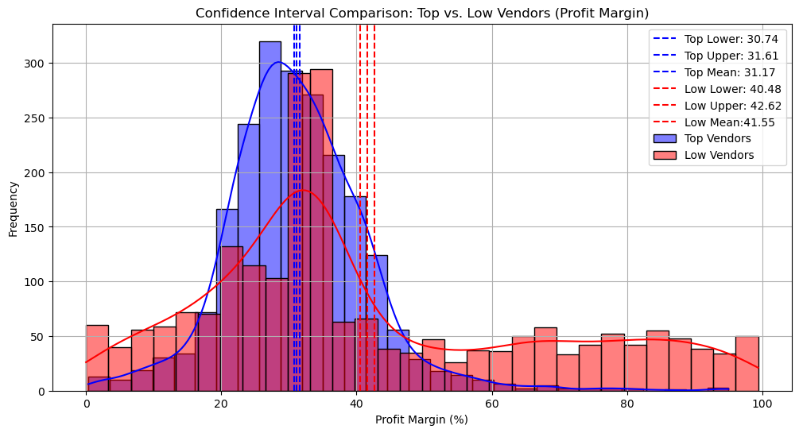
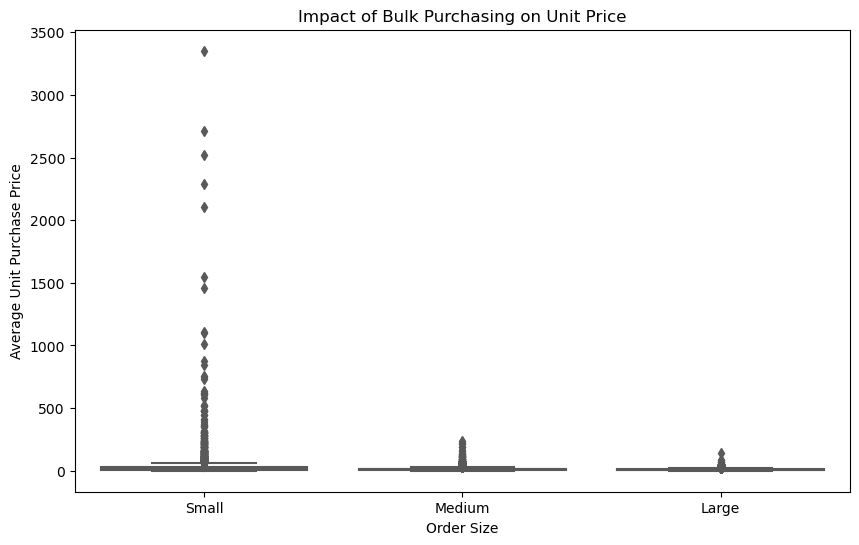

Vendor Sales Summary & Performance Analysis
📌 Project Overview
This project analyzes vendor sales performance by integrating and transforming raw sales, purchase, pricing, and freight datasets into a single vendor sales summary table.
The analysis focuses on profitability, inventory efficiency, vendor contributions, and pricing strategies, with actionable business insights and visualizations.


Project Structure



---

## 🔄 Methodology
1. **Data Ingestion** – All raw CSV files are loaded into `inventory.db` using `ingestion_db.py`.
2. **Data Transformation** – `get_vendor_summary.py` merges purchase, sales, price, and freight data to create a **vendor_sales_summary** table.
3. **Data Cleaning** – Missing values filled, data types fixed, and calculated metrics added:
   - `GrossProfit`
   - `ProfitMargin`
   - `StockTurnover`
   - `SalesToPurchaseRatio`
4. **Exploratory Data Analysis** – Performed in `vendor_performance_analysis.ipynb`.
5. **Visualization & Insights** – Created impactful graphs to communicate business findings.

---

## 📊 Key Insights & Visuals

### **1️⃣ Vendor Contribution & Market Share**

- **Top 10 vendors** account for a significant percentage of total purchases, indicating a **high vendor concentration** and potential **supply chain risk**.
- Some vendors have **dominant purchase shares but lower sales performance**, signaling possible **inventory overstock** or **slow-moving goods**.
- **Strategic implication**: Consider renegotiating contracts with high-purchase but low-sales vendors to improve ROI.

---

### **2️⃣ Sales Performance Leaders**


- **Top Vendors by Sales** clearly show a **core group driving revenue**, making them priority partners for **marketing and promotional investments**.
- **Top Brands by Sales** reveal **customer preferences**, helping guide **inventory planning** and **brand-focused promotions**.
- **Strategic implication**: Allocate more shelf space and marketing budget to high-performing brands while monitoring underperformers for replacement.

---

### **3️⃣ Profitability Analysis**


- **Profit Margin Distribution** shows strong margins for certain vendors, while others have **thin or negative margins**, potentially due to **discount-heavy strategies** or **pricing misalignment**.
- **Confidence interval analysis** indicates a **clear performance gap** between top and bottom vendors, suggesting that **margin optimization** could boost overall profitability.
- **Strategic implication**: Prioritize partnerships with high-margin vendors and adjust pricing for low-margin brands.

---

### **4️⃣ Pricing & Promotional Opportunities**

- The **Promotional Pricing Adjustment scatter plot** identifies brands where **price changes** could stimulate demand without hurting profitability.
- **Strategic implication**: Run targeted price tests for low-selling, high-margin brands to increase turnover.

---

### **5️⃣ Purchase Efficiency & Cost Optimization**

- **Bulk Purchase Impact on Unit Price** confirms that **larger purchase volumes** often secure **lower per-unit costs**, validating bulk procurement strategies.
- **Strategic implication**: Increase bulk orders for fast-moving products to maximize cost efficiency.

---

### **6️⃣ Pareto Vendor Analysis**
*(Already shown in Section 1)*
- Pareto chart confirms that **~20% of vendors contribute ~80% of total purchases**, reinforcing the need to **focus relationship management** on these key players.
- **Strategic implication**: Strengthen terms with the top 20% vendors to secure better pricing and priority supply.

---

### **7️⃣ Operational Metrics from Vendor Summary**
- **Stock Turnover** analysis shows certain vendors have **slower-moving stock**, increasing **holding costs**.
- **Sales-to-Purchase Ratio** highlights inefficiencies in converting purchases into sales for some vendors.
- **Strategic implication**: Optimize reorder points and negotiate flexible purchase agreements for slow-moving inventory.

---

## 🚀 Future Improvements
- Automate data ingestion via scheduled ETL pipelines.
- Add forecasting models to predict vendor performance.
- Integrate dashboarding tools (Power BI / Tableau) for real-time reporting.
- Enhance data quality checks to handle missing or inconsistent records.

---

## 📌 How to Run the Project
```bash
# 1. Clone repository
git clone https://github.com/your-username/vendor-sales-summary.git
cd vendor-sales-summary

# 2. Install dependencies
pip install -r requirements.txt

# 3. Run ingestion script to load data into database
python ingestion_db.py

# 4. Generate vendor sales summary table
python get_vendor_summary.py

# 5. Open Jupyter Notebook for analysis
jupyter notebook notebooks/vendor_performance_analysis.ipynb
